---
## Front matter
lang: ru-RU
title: Реализация индивидуального проекта. Часть 5
subtitle: Операционные системы
author:
  - Перегудов А.В.
institute:
  - Российский университет дружбы народов, Москва, Россия
date: 11 Мая 2024

## i18n babel
babel-lang: russian
babel-otherlangs: english

## Fonts
mainfont: PT Serif
romanfont: PT Serif
sansfont: PT Sans
monofont: PT Mono
mainfontoptions: Ligatures=TeX
romanfontoptions: Ligatures=TeX
sansfontoptions: Ligatures=TeX,Scale=MatchLowercase
monofontoptions: Scale=MatchLowercase,Scale=0.9

## Formatting pdf
toc: false
toc-title: Содержание
slide_level: 2
aspectratio: 169
section-titles: true
theme: metropolis
header-includes:
 - \metroset{progressbar=frametitle,sectionpage=progressbar,numbering=fraction}
 - '\makeatletter'
 - '\beamer@ignorenonframefalse'
 - '\makeatother'
---

# Информация

## Докладчик

  * Перегудов Александр Вадимович
  * Студент группы НКАбд-04-23
  * Российский университет дружбы народов
  * [1132239659@pfur.ru]
  * <https://github.com/magister6239/project>

# Вводная часть

## Актуальность

- Создание сайтов является полезным навыком в современном мире.

## Объект и предмет исследования

- HUGO
- Блок проектов

## Цели и задачи

- Добавить к сайту все остальные элементы
- Сделать пост по прошедшей неделе
- Добавить пост по тему "Языки научного программирования"

## Материалы и методы

- Процессор `pandoc` для входного формата Markdown
- Результирующие форматы
	- `pdf`
	- `html`
- Автоматизация процесса создания: `Makefile`

## Добавление записей для персональных проектов

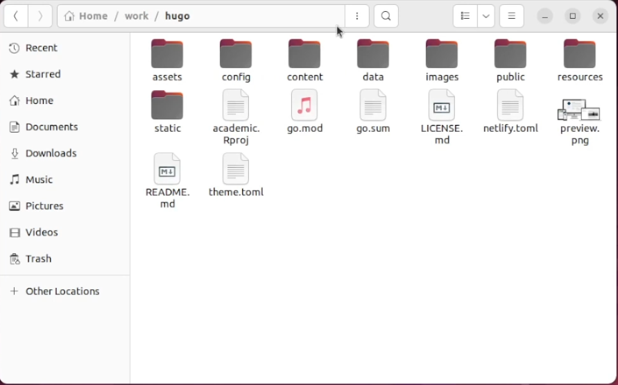{width=70%}

## Добавление записей для персональных проектов

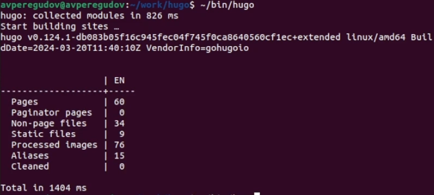{width=70%}

## Добавление записей для персональных проектов

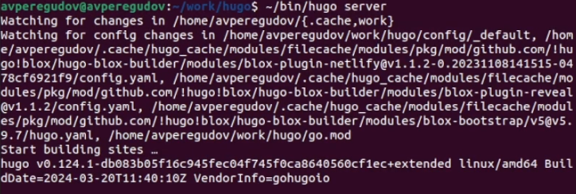{width=70%}

## Добавление записей для персональных проектов

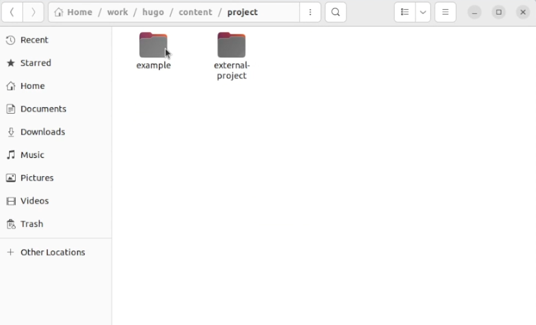{width=70%}

## Добавление записей для персональных проектов

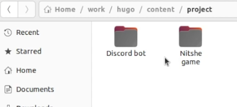{width=70%}

## Добавление записей для персональных проектов

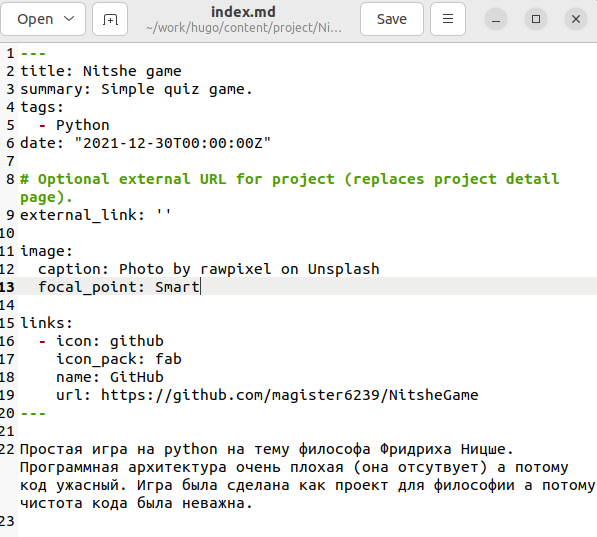{width=70%}

## Добавление записей для персональных проектов

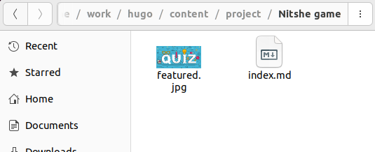{width=70%}

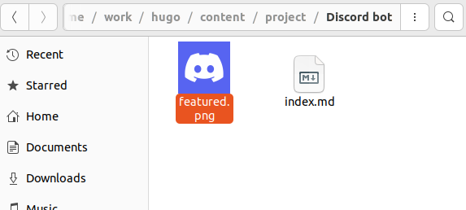{width=70%}

## Добавление записей для персональных проектов

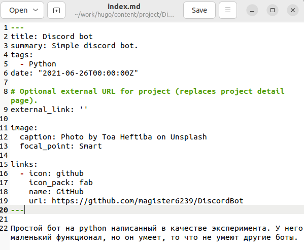{width=70%}

## Добавление записей для персональных проектов

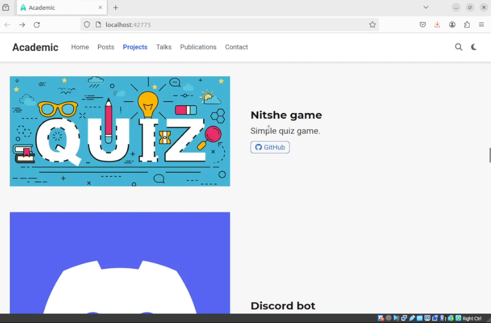{width=70%}

## Добавление записей для персональных проектов

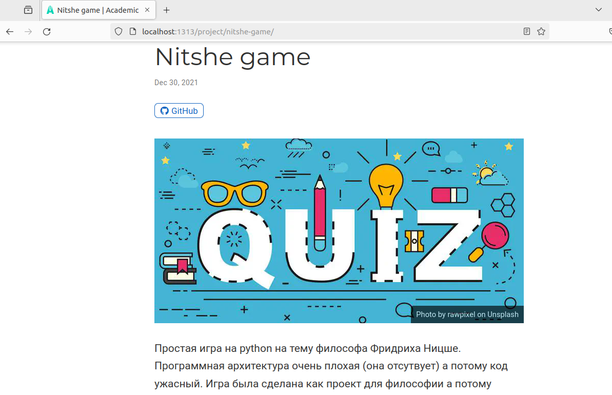{width=70%}

## Добавление записей для персональных проектов

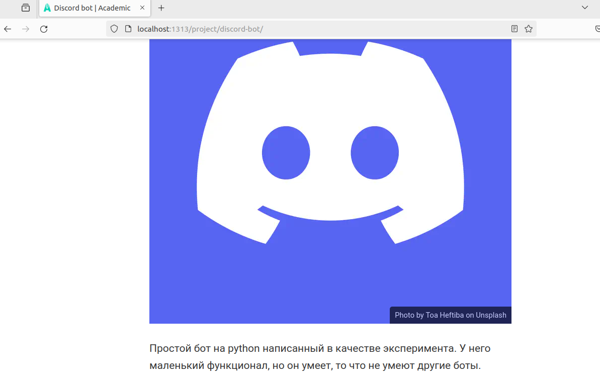{width=70%}

## Добавление поста по прошедшей неделе

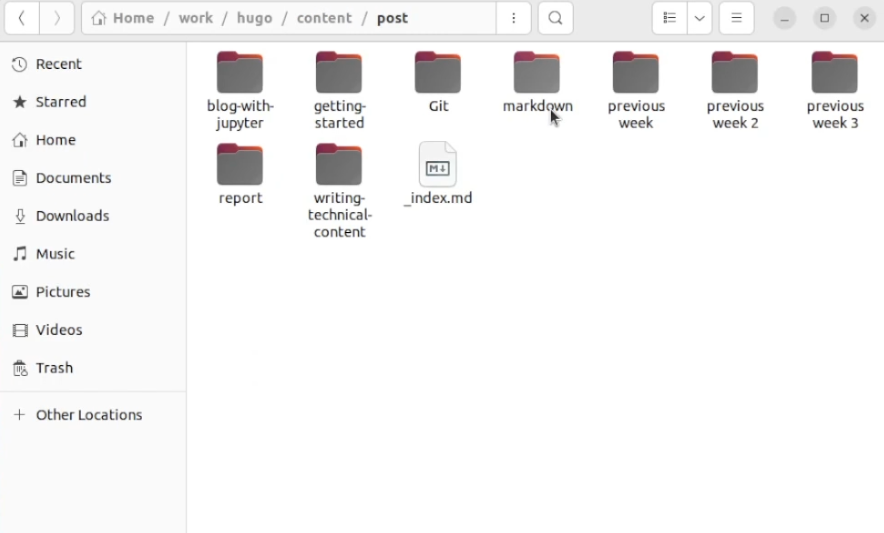{width=70%}

## Добавление поста по прошедшей неделе

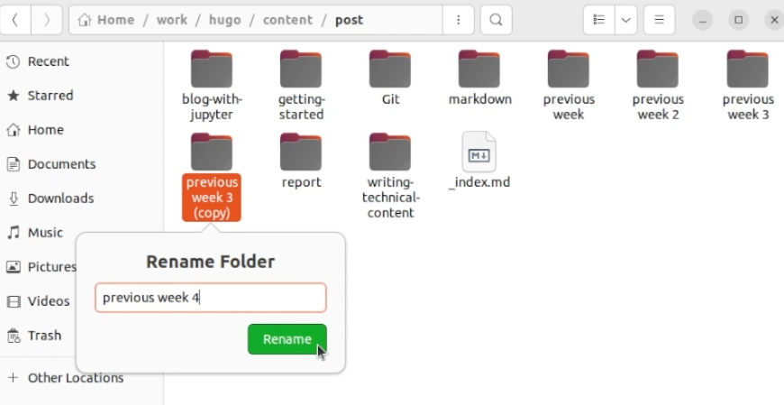{width=70%}

## Добавление поста по прошедшей неделе

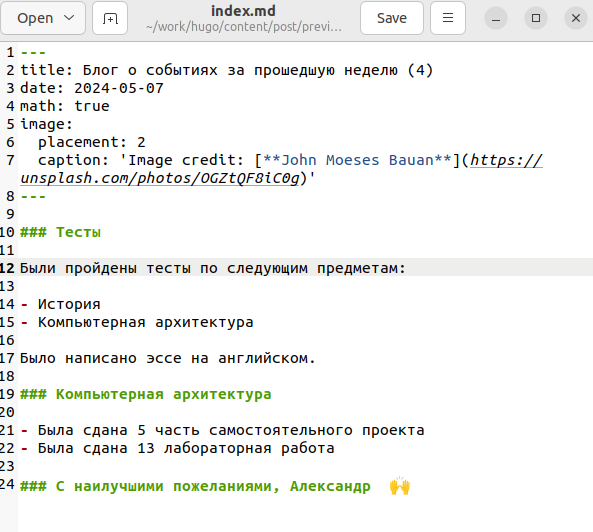{width=70%}

## Добавление поста на тему по выбору "Языки научного программирования"

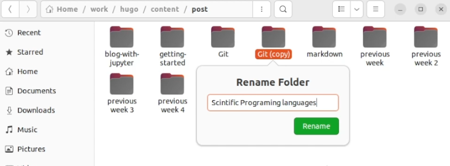{width=70%}

## Добавление поста на тему по выбору "Языки научного программирования"

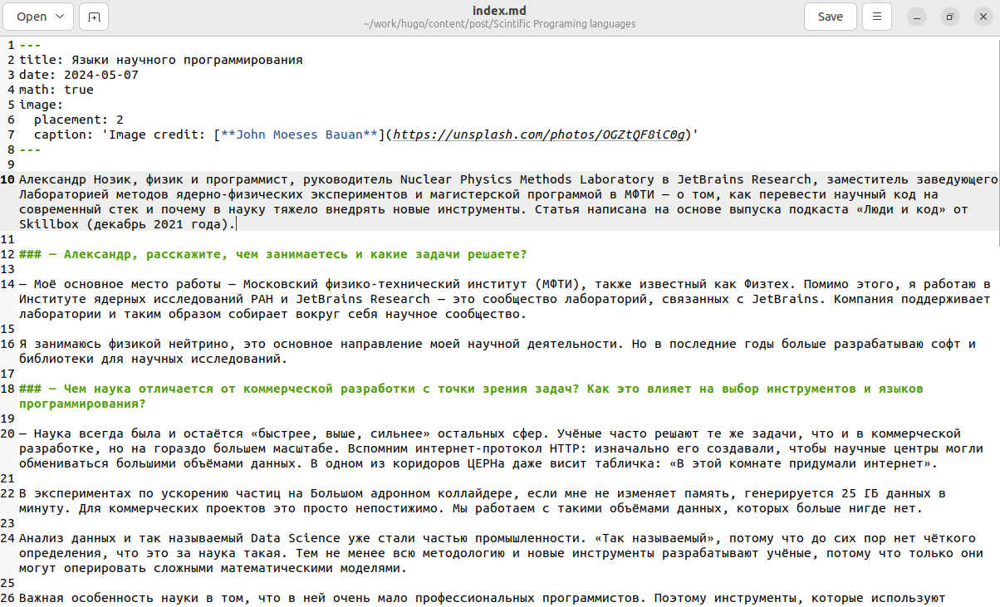{width=70%}

## Добавление поста на тему по выбору "Языки научного программирования"

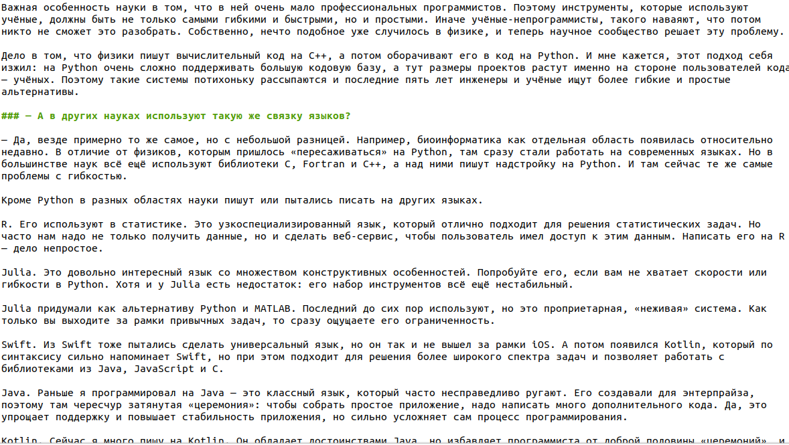{width=70%}

## Добавление поста на тему по выбору "Языки научного программирования"

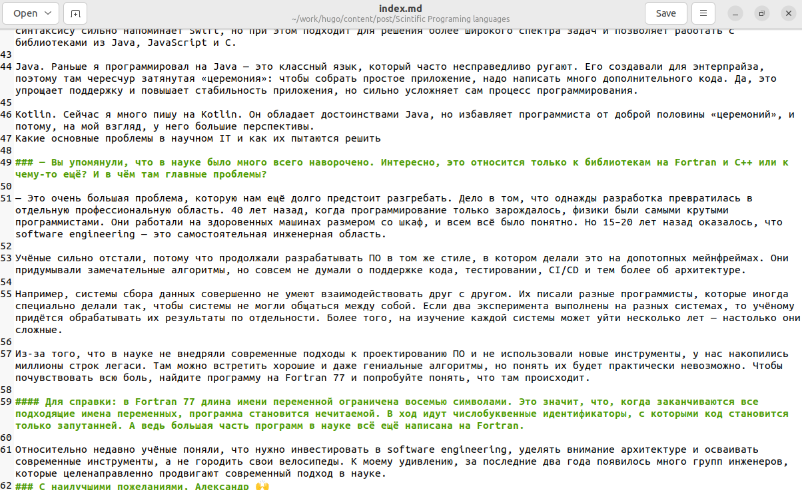{width=70%}

## Добавление поста на тему по выбору "Языки научного программирования"

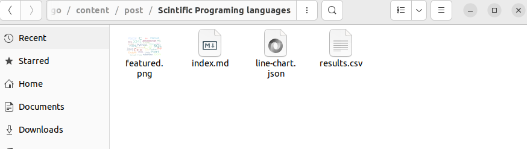{width=70%}

## Проверка добавленных постов

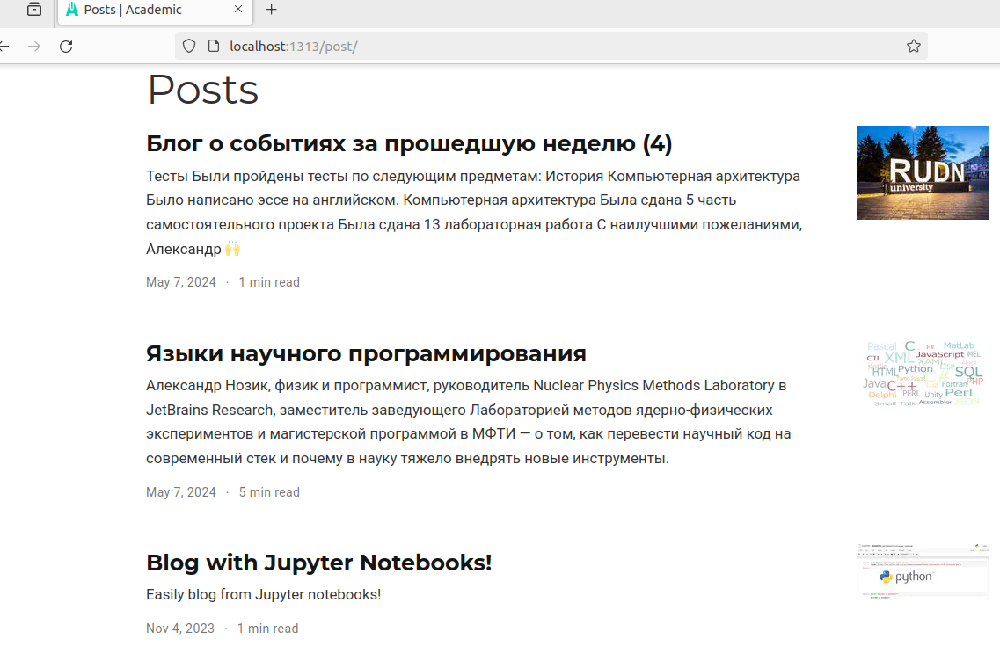{width=70%}

## Проверка добавленных постов

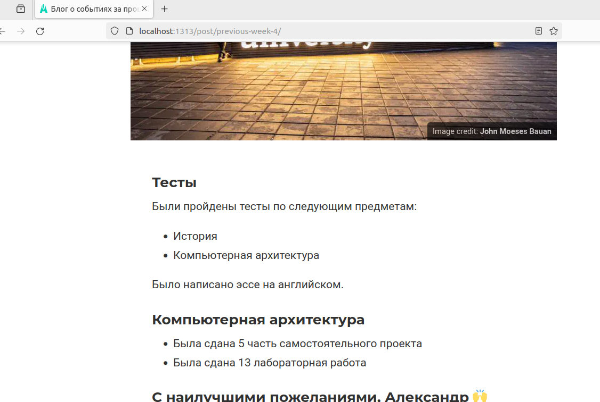{width=70%}

## Проверка добавленных постов

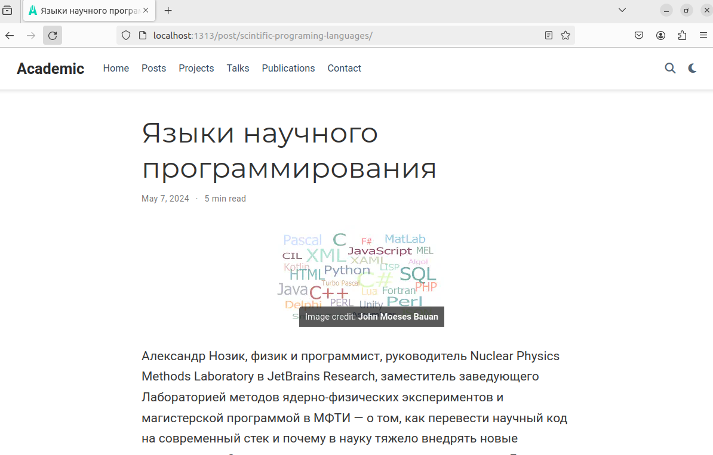{width=70%}
